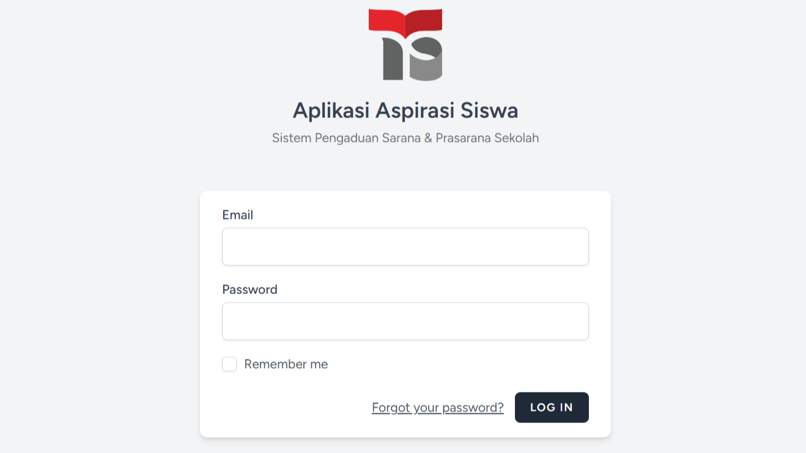
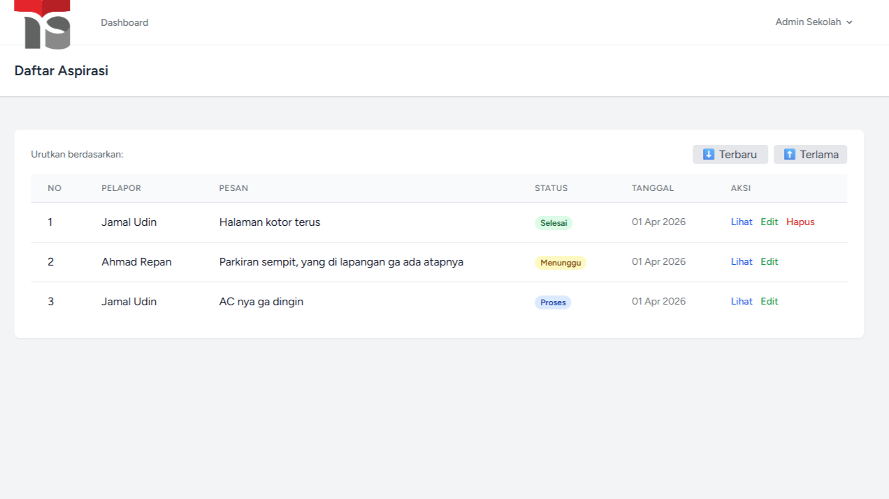
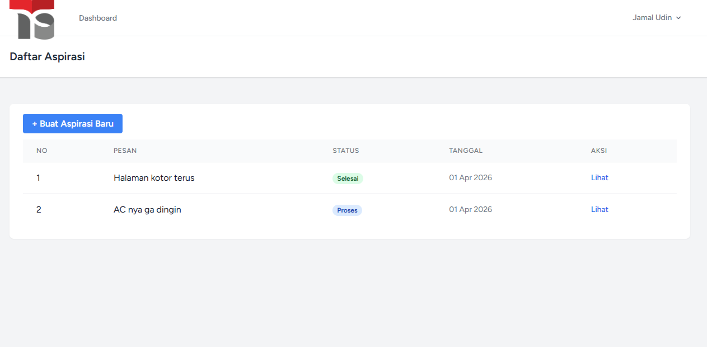
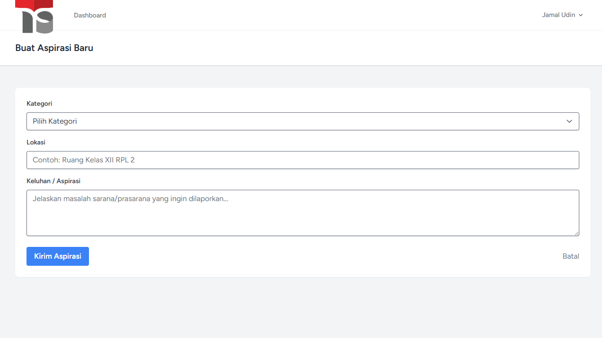
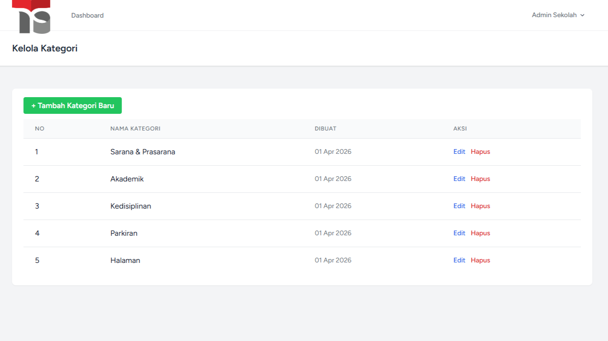

# 📋 Aplikasi Aspirasi Siswa

<div align="center">


**Sistem Pengaduan Sarana & Prasarana Sekolah**

</div>

---

## 📖 Tentang Project

Aplikasi Aspirasi Siswa adalah sistem web berbasis Laravel untuk mengelola pengaduan dan aspirasi siswa terkait sarana dan prasarana sekolah. Aplikasi ini memudahkan siswa untuk menyampaikan laporan dan admin untuk mengelola serta memberikan feedback.

---

## ✨ Fitur Utama

### 👤 Siswa
- ✅ Login dengan email dan password
- ✅ Membuat aspirasi/laporan baru
- ✅ Melihat daftar aspirasi yang pernah dibuat
- ✅ Melihat status aspirasi (Menunggu, Proses, Selesai)
- ✅ Melihat feedback/tanggapan dari admin

### 🔐 Admin
- ✅ Login dengan email dan password
- ✅ Melihat semua aspirasi dari siswa
- ✅ Filter aspirasi (sorting terbaru/terlama)
- ✅ Mengupdate status aspirasi (Menunggu, Proses, Selesai)
- ✅ Memberikan feedback/tanggapan pada aspirasi
- ✅ Mengelola kategori aspirasi (Tambah, Edit, Hapus)
- ✅ Menghapus aspirasi yang sudah selesai
---

## 🖼️ Screenshots

### 🔐 Halaman Login
<div align="center">
  
</div>

### 📊 Dashboard
<div align="center">
  
</div>

### 📋 Daftar Aspirasi
<div align="center">
  
</div>

### ✍️ Form Aspirasi
<div align="center">
  
</div>

### 🏷️ Kelola Kategori
<div align="center">
  
</div>

---

## 🛠️ Teknologi yang Digunakan

| Teknologi | Versi |
|-----------|-------|
| Laravel | 13.2.0 |
| PHP | 8.5.1 |
| MySQL | 8.0.30 |
| Laravel Breeze | 2.4.1 |
| Tailwind CSS | 3.4.19 |
| Node.js | 24.12.0 |

---

## 📦 Instalasi

### 1. Clone Repository
```bash
git clone https://github.com/Rakafikri/app-aspirasi-siswa
cd app-aspirasi-siswa
```

### 2. Install Dependencies
```bash
composer install
npm install && npm run build
```

### 3. Konfigurasi Environment
```bash
cp .env.example .env
php artisan key:generate
```

### 4. Konfigurasi Database
Edit file `.env`:
```env
DB_CONNECTION=mysql
DB_HOST=127.0.0.1
DB_PORT=3306
DB_DATABASE=aspirasi_siswa
DB_USERNAME=root
DB_PASSWORD=
```

### 5. Jalankan Migration
```bash
php artisan migrate
```

### 6. Build Assets
```bash
npm run build
```

### 7. Menambahkan data dummy via tinker
```bash
php artisan tinker
```
lalu paste command ini di terminal
```
\App\Models\User::create([
    'name' => 'Admin Sekolah',
    'email' => 'admin@sekolah.id',
    'password' => bcrypt('password123'),
    'role' => 'admin',
    'nis' => null,
    'kelas' => null,
]);

\App\Models\User::create([
    'name' => 'Ahmad Repan',
    'email' => 'ahmad@sekolah.id',
    'password' => bcrypt('password123'),
    'role' => 'siswa',
    'nis' => 12345,
    'kelas' => 'XII RPL 1',
]);

\App\Models\User::create([
    'name' => 'Jamal Udin',
    'email' => 'jamal@sekolah.id',
    'password' => bcrypt('password123'),
    'role' => 'siswa',
    'nis' => 123456,
    'kelas' => 'XII RPL 2',
]);

\App\Models\Kategori::create(['ket_kategori' => 'Sarana & Prasarana']);
\App\Models\Kategori::create(['ket_kategori' => 'Akademik']);
\App\Models\Kategori::create(['ket_kategori' => 'Kedisiplinan']);
exit

```

### 8. Jalankan Server
```bash
php artisan serve
```

Akses aplikasi di: **http://localhost:8000**

## 📁 Struktur Database

### Tabel Users
| Field | Type | Keterangan |
|-------|------|------------|
| id | bigint | Primary Key |
| name | string | Nama User |
| email | string | Email (untuk login) |
| role | enum | admin / siswa |
| nis | integer | NIS (untuk siswa) |
| kelas | string | Kelas (untuk siswa) |

### Tabel Kategori
| Field | Type | Keterangan |
|-------|------|------------|
| id_kategori | bigint | Primary Key |
| ket_kategori | string | Nama Kategori |

### Tabel Aspirasi
| Field | Type | Keterangan |
|-------|------|------------|
| id_aspirasi | bigint | Primary Key |
| user_id | bigint | Foreign Key → Users |
| id_kategori | bigint | Foreign Key → Kategori |
| lokasi | string | Lokasi Masalah |
| kel | text | Keluhan/Aspirasi |
| status | enum | Menunggu / Proses / Selesai |
| feedback | text | Tanggapan Admin |

---

## 🚀 Fitur Tambahan

- 🔐 Authentication dengan Laravel Breeze
- 🎨 UI Modern dengan Tailwind CSS
- 📱 Responsive Design
- 🔒 Role-based Access Control (Admin & Siswa)
- 📊 Real-time Status Update
- 🗂️ Dynamic Category Management

---

## 📝 License

Project ini open-source dan dilisensikan di bawah [MIT License](https://opensource.org/licenses/MIT).

---

Dibuat dengan ❤️ menggunakan Laravel